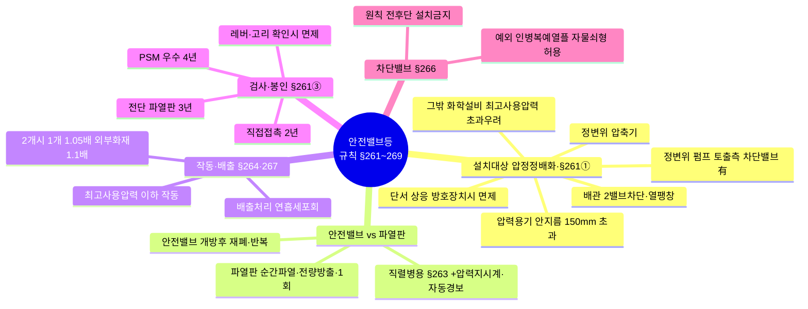
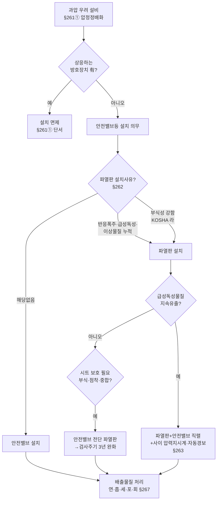
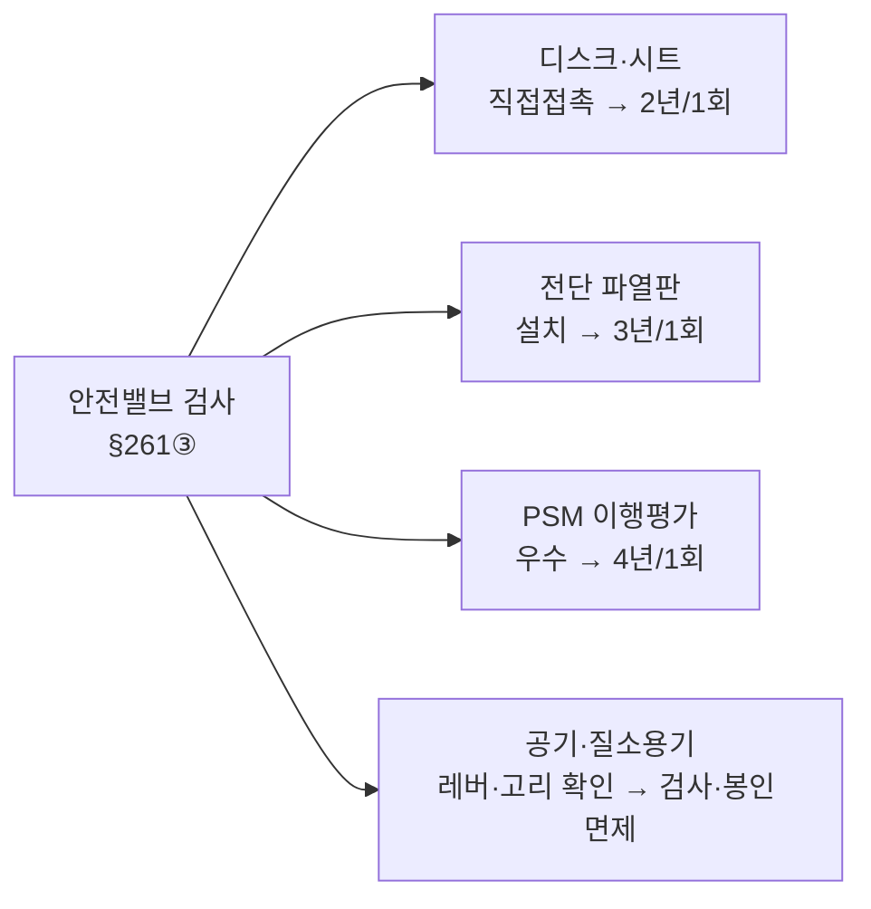
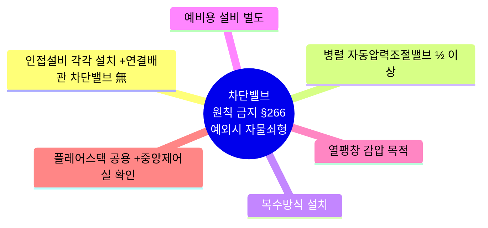
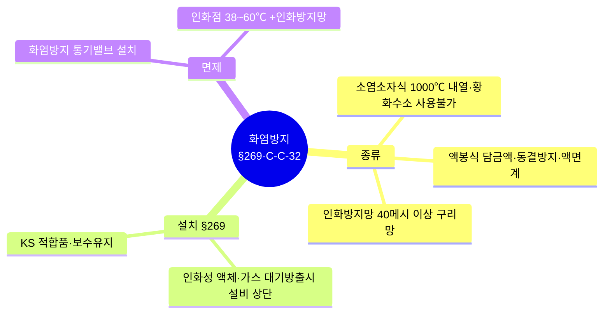

# 1. 안전장치 — 안전밸브·파열판·화염방지기

> 핵심 근거: 산안보칙 제261~269조 + KOSHA C-C-9/11/18/19/32/90, D-62.
> **답안은 법령·KOSHA 원문 그대로 인용**(핵심 키워드 **굵게**). 조문은 【근거】 링크로 law.go.kr 최신본 확인 가능.
> ⚠️ 제269조는 2022.10.18 개정. "40메시"는 규칙엔 미명시이나 **KOSHA C-C-32-2026 원문에 명시**되어 KOSHA 근거로 인용.

## 📊 한눈에 보기 (도식)

### ① 안전밸브등 전체 조망 (§261~269)

### ② 설치 의사결정 흐름 — 안전밸브냐 파열판이냐 (§261→262→263)

### ③ 검사주기 — 직2·파3·우4 (§261③)

> 💡 **암기** 검사주기 **"직2·파3·우4"** — **직**접접촉 2년, **파**열판전단 3년, **우**수사업장 4년

### ④ 차단밸브 설치금지 예외 6가지 — 인병복예열플 (§266)

> 💡 **암기** **"인병복예열플"** — **인**접·**병**렬·**복**수·**예**비 갖추면 **열**쇠 채워 OK, **플**레어는 중앙제어로

### ⑤ 화염방지기·인화방지망 (§269 · KOSHA C-C-32)

## 📋 전체 문항 (24문 · 원문 그대로)

> 각 문항을 누르면 펼쳐집니다. 모범답안은 법령·KOSHA·고시 **원문 그대로**입니다.

### Q1-1. 안전밸브 등을 설치해야 하는 대상 설비를 설명하시오.
【빈출/회차】 실제기출 21·23회 (고빈출)
【근거】 [규칙 제261조①](https://www.law.go.kr/법령/산업안전보건기준에%20관한%20규칙/제261조)

**모범답안** — 규칙 제261조제1항 원문:
> 사업주는 다음 각 호의 어느 하나에 해당하는 설비에 대해서는 **과압에 따른 폭발을 방지**하기 위하여 폭발 방지 성능과 규격을 갖춘 **안전밸브 또는 파열판**(이하 "안전밸브등"이라 한다)을 설치하여야 한다. 다만, **안전밸브등에 상응하는 방호장치**를 설치한 경우에는 그러하지 아니하다.
> 1. **압력용기**(안지름이 150밀리미터 이하인 압력용기는 제외하며, 압력용기 중 관형 열교환기의 경우에는 관의 파열로 인하여 상승한 압력이 압력용기의 최고사용압력을 초과할 우려가 있는 경우만 해당한다)
> 2. **정변위 압축기**
> 3. **정변위 펌프**(토출측에 차단밸브가 설치된 것만 해당한다)
> 4. **배관**(2개 이상의 밸브에 의하여 차단되어 대기온도에서 액체의 열팽창에 의하여 파열될 우려가 있는 것으로 한정한다)
> 5. 그 밖의 화학설비 및 그 부속설비로서 해당 설비의 **최고사용압력을 초과할 우려**가 있는 것
> 💡 **암기**: "압정정배화" 💥 **압정**이 **정**수리와 **배**에 **화**악 꽂힌다! — 압(압력용기)·정(정변위 압축기)·정(정변위 펌프)·배(배관)·화(그 밖의 화학설비·부속설비)

### Q1-2. 안전밸브의 검사주기를 설명하시오.
【빈출/회차】 실제기출 21·23회 (고빈출)
【근거】 [규칙 제261조③⑤](https://www.law.go.kr/법령/산업안전보건기준에%20관한%20규칙/제261조)

**모범답안** — 규칙 제261조제3항 원문:
> 제1항에 따라 설치된 안전밸브에 대해서는 다음 각 호의 구분에 따른 검사주기마다 국가교정기관에서 교정을 받은 압력계를 이용하여 **설정압력에서 안전밸브가 적정하게 작동**하는지를 검사한 후 **납으로 봉인**하여 사용하여야 한다. (다만, 공기나 질소취급용기 등에 설치된 안전밸브 중 안전밸브 자체에 부착된 레버 또는 고리를 통하여 수시로 적정 작동을 확인할 수 있는 경우에는 검사하지 아니할 수 있고 납으로 봉인하지 아니할 수 있다.)
> 1. 화학공정 유체와 안전밸브의 **디스크 또는 시트가 직접 접촉**될 수 있도록 설치된 경우: **2년마다 1회 이상**
> 2. 안전밸브 **전단에 파열판이 설치**된 경우: **3년마다 1회 이상**
> 3. 영 제43조에 따른 공정안전보고서 제출 대상으로서 **이행상태 평가결과가 우수**한 사업장의 안전밸브의 경우: **4년마다 1회 이상**

> 제261조제4항: "제3항 각 호에 따른 검사주기에도 불구하고 안전밸브가 설치된 압력용기에 대하여 「고압가스 안전관리법」 제17조제2항에 따라 시장ㆍ군수 또는 구청장의 **재검사**를 받는 경우로서 압력용기의 재검사주기에 대하여 같은 법 시행규칙 별표22 제2호에 따라 산업통상부장관이 정하여 고시하는 기법에 따라 산정하여 그 적합성을 인정받은 경우에는 해당 안전밸브의 검사주기는 **그 압력용기의 재검사주기에 따른다.**"

> 함정(❌) 제5항: "사업주는 제3항에 따라 **납으로 봉인된 안전밸브를 해체하거나 조정할 수 없도록** 조치하여야 한다."

### Q1-3. 파열판을 설치해야 하는 경우를 설명하시오.
【빈출/회차】 실제기출 10회
【근거】 [규칙 제262조](https://www.law.go.kr/법령/산업안전보건기준에%20관한%20규칙/제262조) · [KOSHA C-C-90-2026](04_면접문제은행_2권.md#k-cc90)

**모범답안** — 규칙 제262조 원문:
> 사업주는 제261조제1항 각 호의 설비가 다음 각 호의 어느 하나에 해당하는 경우에는 **파열판을 설치**하여야 한다.
> 1. **반응 폭주** 등 급격한 압력 상승 우려가 있는 경우
> 2. **급성 독성물질**의 누출로 인하여 주위의 작업환경을 오염시킬 우려가 있는 경우
> 3. 운전 중 안전밸브에 **이상 물질이 누적**되어 안전밸브가 작동되지 아니할 우려가 있는 경우

**모범답안** — KOSHA C-C-90-2026 「5.2 파열판 설치기준」 원문(규칙 3호 + 4번째 기준·독성 단서):
> (가) 반응폭주 등 급격한 압력상승의 우려가 있는 경우
> (나) **독성물질의 누출**로 인하여 주위 작업환경을 오염시킬 우려가 있는 경우. **다만, 안전밸브를 설치하고 후단에 배출물질을 처리할 수 있는 설비가 설치된 경우는 파열판을 설치하지 아니할 수 있다.**
> (다) 운전 중 안전밸브에 이상물질이 누적되어 안전밸브의 기능을 저하시킬 우려가 있는 경우(이 경우는 **보호기기의 노즐에 파열판을 설치**하여야 함)
> (라) **유체의 부식성이 강하여 안전밸브 재질의 선정에 문제가 있는 경우**
> 함정(❌) KOSHA는 규칙 3개 항목에 **부식성 강한 유체**(라)를 추가한 4가지. 독성물질 항목은 **후단 처리설비가 있으면 파열판 생략 가능**(단서 주의).
> 🔗 파열판·안전밸브 직렬(대량 독성 지속유출, 규칙 제263조) → Q1-13·Q1-25. 안전밸브 후단 파열판 → Q1-36.

### Q1-6. 안전밸브등에서 배출되는 위험물질의 처리 방법을 설명하시오.
【빈출/회차】 실제기출 이전 (고빈출)
【근거】 [규칙 제267조](https://www.law.go.kr/법령/산업안전보건기준에%20관한%20규칙/제267조)

**모범답안** — 규칙 제267조 본문 원문:
> 사업주는 안전밸브등으로부터 배출되는 위험물은 **연소ㆍ흡수ㆍ세정(洗淨)ㆍ포집(捕集) 또는 회수** 등의 방법으로 처리하여야 한다.
> 💡 **암기**: "연흡세포회" 💥 **연**기 **흡**입하면 **세포**가 **회**까닥 — 연(연소)·흡(흡수)·세(세정)·포(포집)·회(회수)

### Q1-7. 안전밸브 배출물질을 안전한 장소로 유도하여 외부로 직접 배출할 수 있는 경우를 설명하시오.
【빈출/회차】 실제기출 13·22회
【근거】 [규칙 제267조 단서](https://www.law.go.kr/법령/산업안전보건기준에%20관한%20규칙/제267조)

**모범답안** — 규칙 제267조 단서 각 호 원문 (다음에 해당하면 안전한 장소로 유도하여 외부로 직접 배출 가능):
> 1. 배출물질을 연소ㆍ흡수ㆍ세정ㆍ포집 또는 회수 등의 방법으로 처리할 때에 **파열판의 기능을 저해**할 우려가 있는 경우
> 2. 배출물질을 연소처리할 때에 **유해성가스를 발생**시킬 우려가 있는 경우
> 3. **고압상태의 위험물이 대량으로 배출**되어 연소ㆍ흡수ㆍ세정ㆍ포집 또는 회수 등의 방법으로 완전히 처리할 수 없는 경우
> 4. 공정설비가 있는 지역과 떨어진 인화성 가스 또는 인화성 액체 **저장탱크**에 안전밸브등이 설치될 때에 저장탱크에 **냉각설비 또는 자동소화설비** 등 안전상의 조치를 하였을 경우
> 5. 그 밖에 배출량이 적거나 배출 시 급격히 분산되어 재해의 우려가 없으며, 냉각설비 또는 자동소화설비를 설치하는 등 안전상의 조치를 하였을 경우
> 💡 **암기**: "파유대저소" 💥 **파**열 직전 **유**독가스 **대**량 분출 — **저**장탱크는 **소**량만 봐준다 — 파(파열판 기능 저해)·유(연소처리 시 유해성가스 발생)·대(고압 위험물 대량 배출)·저(저장탱크+냉각·자동소화설비)·소(소량·급분산+안전조치)

### Q1-9. 화염방지기의 종류와 각각의 장단점(특성)을 설명하시오.
【빈출/회차】 실제기출 12·14회 (대면 기습 예시)
【근거】 [규칙 제269조](https://www.law.go.kr/법령/산업안전보건기준에%20관한%20규칙/제269조) · [KOSHA C-C-32-2026](04_면접문제은행_2권.md#k-cc32)

**모범답안** — KOSHA C-C-32-2026 원문 인용.
**① 소염소자식 화염방지기**(7.1):
> (1) 본체는 금속제로서 **내식성**이 있어야 하며, 폭발 및 화재로 인한 압력과 온도에 견딜 수 있어야 한다.
> (2) 소염소자는 내식성이 있고, **1,000℃ 이상에서 변형 등이 없는 내열성**이 있는 재질이어야 하며, 이물질 등의 제거를 위한 정비작업이 용이하여야 한다.
> (4) 모든 접합부는 **화염이 소염소자를 우회하지 않고**, 방지장치의 내부로 전파되지 않는 구조이거나 밀봉되어야 한다.
> (5) **황화수소, 황성분** 등이 함유된 가스가 배관 내에서 자연발화성 물질로 전환될 우려가 있는 경우에는 **소염소자식 화염방지기를 사용할 수 없다.**

**② 액봉식 화염방지기**(7.2):
> (1) 본체는 불연성이고 **1,000℃ 이상의 내열성**이 있어야 하고, 담금 액체에 대하여 내식성이 있어야 한다.
> (3) … 담금 액체로 물을 사용하는 경우와 같이 결빙의 우려가 있는 경우에는 **동결방지조치**를 하여야 한다. 또한 내부의 액면을 확인하기 위한 **액면계 또는 투시창(Sight glass)**을 설치하고 …
> (4) 액체의 액면이 높거나 낮아서 화염방지기능이 저하될 우려가 있는 경우에는 **자동 액면조절장치**를 설치하고 … **경보장치**를 설치하여야 한다.

**③ 인화방지망**(3. 용어의 정의 (자)):
> "인화방지망"이라 함은 외부에서 발생한 화염의 전파를 억제하기 위하여 통기관 끝에 설치하는 **40 메시(Mesh) 이상의 구리망** 등으로 만들어진 인화방지장치를 말한다.
> 함정(❌) **H₂S·황성분** 함유 가스 → 소염소자식 **사용 불가**.

### Q1-10. 화염방지기의 설치대상·위치와 면제(제외)조건을 설명하시오.
【빈출/회차】 실제기출 13회
【근거】 [규칙 제269조](https://www.law.go.kr/법령/산업안전보건기준에%20관한%20규칙/제269조)

**모범답안** — 규칙 제269조 원문:
> ① 사업주는 **인화성 액체 및 인화성 가스**를 저장ㆍ취급하는 화학설비에서 증기나 가스를 **대기로 방출**하는 경우에는 외부로부터의 화염을 방지하기 위하여 **화염방지기를 그 설비 상단에 설치**해야 한다. 다만, 대기로 연결된 통기관에 **화염방지 기능이 있는 통기밸브**가 설치되어 있거나, **인화점이 섭씨 38도 이상 60도 이하**인 인화성 액체를 저장ㆍ취급할 때에 화염방지 기능을 가지는 **인화방지망**을 설치한 경우에는 그렇지 않다.
> ② 사업주는 제1항의 화염방지기를 설치하는 경우에는 **한국산업표준에서 정하는 화염방지장치 기준에 적합**한 것을 설치하여야 하며, 항상 철저하게 보수ㆍ유지하여야 한다.

### Q1-11. 안전밸브 소요분출량 산정 시 고려하는 과압발생 원인을 설명하시오.
【빈출/회차】 실제기출 14회 (코샤가이드 14가지)
【근거】 [KOSHA C-C-90-2026](04_면접문제은행_2권.md#k-cc90) · [규칙 제265조](https://www.law.go.kr/법령/산업안전보건기준에%20관한%20규칙/제265조)

**모범답안** — KOSHA C-C-90-2026 「6. 소요 분출량」 원문:
> 과압발생 원인은 **① 출구 차단, ② 냉각 또는 환류 중단, ③ 흡수제 공급 중단, ④ 비응축성 가스의 축적, ⑤ 휘발성 물질 유입, ⑥ 과충전, ⑦ 자동제어밸브의 고장, ⑧ 비정상적인 열 또는 증기유입, ⑨ 내부폭발 또는 과도적 압력상승, ⑩ 화학반응, ⑪ 유압팽창, ⑫ 외부화재, ⑬ 열교환기 고장, ⑭ 유틸리티 고장** 등이며 원인별 압력방출 규정은 <표 2>와 같다.
> 🔗 배출용량은 각 작동원인별 소요분출량 중 **가장 큰 수치**로 결정(규칙 제265조).
> 💡 **암기**: "출냉흡비휘과 / 자비내화 / 유외열유" 💥 **출**구 막히고 **냉**각 끊기고 **흡**수 멈춰 — **비**응축가스에 **휘**발분 **과**충전 / **자**동밸브 죽고 **비**정상 열에 **내**부폭발·**화**학반응 / **유**압 팽창, **외**부 화재, **열**교환기·**유**틸리티 전멸 — 출(출구 차단)·냉(냉각·환류 중단)·흡(흡수제 공급 중단)·비(비응축성 가스 축적)·휘(휘발성 물질 유입)·과(과충전) / 자(자동제어밸브 고장)·비(비정상적 열·증기 유입)·내(내부폭발·과도압력)·화(화학반응) / 유(유압팽창)·외(외부화재)·열(열교환기 고장)·유(유틸리티 고장)

### Q1-13. 파열판과 안전밸브의 직렬설치에 대해 설명하시오.
【빈출/회차】 실제기출 22회 (안전밸브 빈출)
【근거】 [규칙 제263조](https://www.law.go.kr/법령/산업안전보건기준에%20관한%20규칙/제263조) · [KOSHA C-C-19-2026](04_면접문제은행_2권.md#k-cc19)

**모범답안** — 규칙 제263조 원문:
> 사업주는 **급성 독성물질이 지속적으로 외부에 유출**될 수 있는 화학설비 및 그 부속설비에 **파열판과 안전밸브를 직렬로 설치**하고 **그 사이에는 압력지시계 또는 자동경보장치**를 설치하여야 한다.
> 🔗 목적: 부식·점착성 유체로부터 안전밸브 보호 + 파열판 핀홀(미세누설)을 사이 공간 압력상승으로 감지.

### Q1-14. 안전밸브등의 작동요건을 설명하시오.
【빈출/회차】 예상 (조문 빈출)
【근거】 [규칙 제264조](https://www.law.go.kr/법령/산업안전보건기준에%20관한%20규칙/제264조)

**모범답안** — 규칙 제264조 원문:
> 사업주는 제261조제1항에 따라 설치한 안전밸브등이 안전밸브등을 통하여 보호하려는 설비의 **최고사용압력 이하**에서 작동되도록 하여야 한다. 다만, 안전밸브등이 **2개 이상 설치**된 경우에 1개는 최고사용압력의 **1.05배**(외부화재를 대비한 경우에는 **1.1배**) 이하에서 작동되도록 설치할 수 있다.

### Q1-15. 안전밸브 전·후단에 차단밸브 설치가 금지되는 원칙과 예외를 설명하시오.
【빈출/회차】 예상 (조문 빈출)
【근거】 [규칙 제266조](https://www.law.go.kr/법령/산업안전보건기준에%20관한%20규칙/제266조)

**모범답안** — 규칙 제266조 원문:
> 사업주는 **안전밸브등의 전단ㆍ후단에 차단밸브를 설치해서는 아니 된다.** 다만, 다음 각 호의 어느 하나에 해당하는 경우에는 **자물쇠형 또는 이에 준하는 형식**의 차단밸브를 설치할 수 있다.
> 1. 인접한 화학설비 및 그 부속설비에 안전밸브등이 각각 설치되어 있고, 해당 화학설비 및 그 부속설비의 연결배관에 차단밸브가 없는 경우
> 2. 안전밸브등의 배출용량의 **2분의 1 이상**에 해당하는 용량의 자동압력조절밸브(구동용 동력원의 공급을 차단하는 경우 열리는 구조인 것으로 한정한다)와 안전밸브등이 **병렬로 연결**된 경우
> 3. 화학설비 및 그 부속설비에 안전밸브등이 **복수방식**으로 설치되어 있는 경우
> 4. **예비용 설비**를 설치하고 각각의 설비에 안전밸브등이 설치되어 있는 경우
> 5. **열팽창**에 의하여 상승된 압력을 낮추기 위한 목적으로 안전밸브가 설치된 경우
> 6. 하나의 **플레어 스택**에 둘 이상의 단위공정의 플레어 헤더를 연결하여 사용하는 경우로서 각각의 플레어헤더에 설치된 차단밸브의 열림ㆍ닫힘 상태를 **중앙제어실**에서 알 수 있도록 조치한 경우
> 💡 **암기**: "인병복예열플" 💥 **인**접·**병**렬·**복**수·**예**비 갖추면 **열**쇠 채워도 OK — **플**레어는 중앙제어로 — 인(인접설비 각각 설치+연결배관에 차단밸브 없음)·병(자동압력조절밸브 ½ 이상 병렬)·복(복수방식)·예(예비용 설비)·열(열팽창 목적)·플(플레어스택 공용+중앙제어실 확인)

### Q1-16. 통기설비(통기관·통기밸브)의 설치에 대해 설명하시오.
【빈출/회차】 예상 (조문)
【근거】 [규칙 제268조](https://www.law.go.kr/법령/산업안전보건기준에%20관한%20규칙/제268조)

**모범답안** — 규칙 제268조 원문:
> ① 사업주는 **인화성 액체를 저장ㆍ취급하는 대기압탱크**에는 **통기관 또는 통기밸브(breather valve)** 등(이하 "통기설비"라 한다)을 설치하여야 한다.
> ② 제1항에 따른 통기설비는 정상운전 시에 대기압탱크 내부가 **진공 또는 가압되지 않도록 충분한 용량**의 것을 사용하여야 하며, 철저하게 유지ㆍ보수를 하여야 한다.

### Q1-18. 안전밸브등의 배출용량 산정 방법을 설명하시오.
【빈출/회차】 예상 (조문+KOSHA)
【근거】 [규칙 제265조](https://www.law.go.kr/법령/산업안전보건기준에%20관한%20규칙/제265조) · [KOSHA C-C-90-2026](04_면접문제은행_2권.md#k-cc90)

**모범답안** — 규칙 제265조 원문:
> 사업주는 안전밸브등에 대하여 배출용량은 그 **작동원인에 따라 각각의 소요분출량을 계산하여 가장 큰 수치**를 해당 안전밸브등의 배출용량으로 하여야 한다.
> 🔗 작동원인(과압발생 원인) 14가지는 Q1-11 참조. 외부화재 시 면적 기반 입열량으로 소요분출량 산정.

### Q1-20. 화염방지기 소염소자의 재질·성능 기준을 설명하시오.
【빈출/회차】 예상 (KOSHA)
【근거】 [KOSHA C-C-32-2026](04_면접문제은행_2권.md#k-cc32) · [규칙 제269조②](https://www.law.go.kr/법령/산업안전보건기준에%20관한%20규칙/제269조)

**모범답안** — KOSHA C-C-32-2026 「7.1 소염소자식 화염방지기」 원문:
> (1) 본체는 금속제로서 **내식성**이 있어야 하며, 폭발 및 화재로 인한 압력과 온도에 견딜 수 있어야 한다.
> (2) 소염소자는 내식성이 있고, **1,000℃ 이상에서 변형 등이 없는 내열성**이 있는 재질이어야 하며, **정비작업이 용이**하여야 한다.
> (3) 가스킷은 **내식ㆍ내열성** 재질이어야 한다.
> (4) 모든 접합부는 **화염이 소염소자를 우회하지 않고**, 방지장치 내부로 전파되지 않는 구조이거나 밀봉되어야 한다.

「8. 설치 위치 및 방법」(5):
> 소염소자는 **매년 1회 이상** 막힘, 부식, 변형, 파손 등의 상태를 확인하고, 통기가 잘 되도록 청소를 하여야 한다.
> 💡 **암기**: "본소가접" 💥 **본**드로 **소**파 **가**죽 **접**합 — 본(본체 내식·압력온도 견딤)·소(소염소자 1,000℃ 내열·정비 용이)·가(가스킷 내식·내열)·접(접합부 화염 우회 방지·밀봉)

### Q1-21. 인화방지망의 적용 조건을 설명하시오.
【빈출/회차】 예상 (조문+KOSHA)
【근거】 [규칙 제269조① 단서](https://www.law.go.kr/법령/산업안전보건기준에%20관한%20규칙/제269조) · [KOSHA C-C-32-2026](04_면접문제은행_2권.md#k-cc32)

**모범답안**
- 규칙 제269조① 단서 원문:
> **인화점이 섭씨 38도 이상 60도 이하**인 인화성 액체를 저장ㆍ취급할 때에 **화염방지 기능을 가지는 인화방지망**을 설치한 경우에는 (화염방지기 설치를 면제한다.)
- KOSHA C-C-32-2026 「8. 설치 위치 및 방법」(3):
> 상온에서 저장ㆍ취급하는 액체의 인화점이 **38℃ 이상이고 60℃ 이하**인 경우에는 화염방지기의 설치를 생략하고 **인화방지망**을 설치할 수 있다. (인화방지망 = **40메시 이상 구리망**)

### Q1-22. 안전밸브 봉인 및 검사 생략 가능 경우를 설명하시오.
【빈출/회차】 예상 (조문)
【근거】 [규칙 제261조③⑤](https://www.law.go.kr/법령/산업안전보건기준에%20관한%20규칙/제261조)

**모범답안** — 규칙 제261조 원문:
> (제3항 단서) 다만, **공기나 질소취급용기 등에 설치된 안전밸브** 중 안전밸브 자체에 부착된 **레버 또는 고리**를 통하여 수시로 안전밸브가 적정하게 작동하는지를 확인할 수 있는 경우에는 **검사하지 아니할 수 있고 납으로 봉인하지 아니할 수 있다.**
> (제5항) 사업주는 제3항에 따라 **납으로 봉인된 안전밸브를 해체하거나 조정할 수 없도록** 조치하여야 한다.

### Q1-23. 다단형 압축기 등에서 안전밸브 설치 방법을 설명하시오.
【빈출/회차】 예상 (조문)
【근거】 [규칙 제261조②](https://www.law.go.kr/법령/산업안전보건기준에%20관한%20규칙/제261조)

**모범답안** — 규칙 제261조제2항 원문:
> 제1항에 따라 안전밸브등을 설치하는 경우에는 **다단형 압축기 또는 직렬로 접속된 공기압축기**에 대해서는 **각 단 또는 각 공기압축기별로 안전밸브등을 설치**하여야 한다.

### Q1-25. 안전밸브 전단에 파열판을 설치하는 이유와 그 효과를 설명하시오.
【빈출/회차】 예상 (조문 연계)
【근거】 [규칙 제261조③2호](https://www.law.go.kr/법령/산업안전보건기준에%20관한%20규칙/제261조) · [규칙 제263조](https://www.law.go.kr/법령/산업안전보건기준에%20관한%20규칙/제263조)

**모범답안**
1) **목적**: 부식성·점착성·중합성 유체로부터 안전밸브 시트를 **격리·보호**(시트 고착·부식·누설 방지) [통설]
2) **검사주기 효과**: 규칙 제261조제3항제2호 — "**안전밸브 전단에 파열판이 설치된 경우: 3년마다 1회 이상**"(직접접촉 2년 대비 완화)
3) **급성 독성물질 지속유출** 설비는 규칙 제263조에 따라 파열판·안전밸브 **직렬 + 사이에 압력지시계·자동경보장치** 설치

### Q1-27. 안전밸브와 파열판의 차이 및 병용에 대해 설명하시오.
【빈출/회차】 예상 (비교형)
【근거】 [규칙 제261~263조](https://www.law.go.kr/법령/산업안전보건기준에%20관한%20규칙/제261조) · [통설]

**모범답안** [통설 + 조문 연계]
1) **안전밸브**: 설정압에서 개방 후 **재폐(reseating)** → 반복 사용, 미세 과압 조절에 적합
2) **파열판**: 설정압에서 **순간 파열·전량 방출**, 재사용 불가 → 반응폭주·급성독성·이상물질 누적 등(규칙 제262조)에 적합
3) **병용**: 규칙 제263조(직렬+압력지시계/경보), 제261조제3항제2호(전단 파열판 → 안전밸브 보호·검사주기 3년)

### Q1-28. 안전밸브등 미설치가 허용되는 "상응하는 방호장치"의 의미를 설명하시오.
【빈출/회차】 예상 (조문 단서)
【근거】 [규칙 제261조① 단서](https://www.law.go.kr/법령/산업안전보건기준에%20관한%20규칙/제261조)

**모범답안**
1) 규칙 제261조제1항 단서 원문: "다만, **안전밸브등에 상응하는 방호장치**를 설치한 경우에는 그러하지 아니하다."
2) [통설] 의미: 과압을 안전밸브등과 **동등 이상으로 방지**하는 장치(예: 고신뢰도 압력방출·감압시스템, SIL 인증 고압차단 인터록(HIPPS) 등)
3) [통설] 위험성평가·정량적 신뢰도 입증으로 동등 안전성 확인 필요

### Q1-29. 안전밸브의 설정압력(Set pressure)과 분출차(Blowdown)의 정의를 설명하시오.
【빈출/회차】 예상
【근거】 [KOSHA C-C-11-2026 3.(1)(나)](04_면접문제은행_2권.md#k-cc11) · [방호장치 안전인증 고시(고용노동부고시 제2021-22호)](https://www.law.go.kr/행정규칙/방호장치안전인증고시)

**모범답안** — KOSHA C-C-11-2026 3.(1)(나) 원문:
> "**설정압력 (Set pressure)**"이라 함은 **운전중에 안전밸브가 열리도록 설정한 안전밸브 입구측에서의 압력**을 말한다.

**모범답안** — 방호장치 안전인증 고시(압력관련 용어) 원문 [변환본 수록]:
> (1) **설정압력(set pressure)**이란 설계상 정한 안전밸브의 **분출압력**을 말한다.
> (2) **분출압력(popping pressure)**이란 밸브 입구의 압력이 증가하여 **디스크가 열림 방향으로 빠르게 움직여 유체를 분출시킬 때의 입구 쪽 압력**을 말한다.
> (4) **분출정지압력**이란 밸브 입구 쪽 압력이 감소하여 **디스크가 밸브시트에 재접촉하거나 양정이 0이 되었을 때의 압력**을 말한다.
> (5) **분출차(blowdown)**란 **분출압력과 분출정지압력과의 차이**를 말하며 **압력 수치 또는 차이의 백분율**로 표기한다.
> 🔗 C-C-11-2026 연계 용어: **초과압력(Overpressure)** = 배출 시 설정압력 이상으로 올라가는 압력, **축적압력(Accumulated pressure)** = 작동 시 설비내 순간 허용 최대압력. 설정압력 허용 오차(C-C-11): 게이지압 **5 bar 미만 ±0.14 bar 이하**, **5 bar 이상 ±3% 이하**. 함정(❌) 설정압력은 **입구측** 압력, 배압(Back pressure)은 **토출측** 압력(→Q1-27 안전밸브·파열판).

### Q1-32. 안전밸브의 설정압력과 축적압력 기준(설치 수량·화재 여부별)을 설명하시오.
【빈출/회차】 예상 (원문스캔)
【근거】 [KOSHA C-C-90-2026](04_면접문제은행_2권.md#k-cc90) · [규칙 제264조](https://www.law.go.kr/법령/산업안전보건기준에%20관한%20규칙/제264조)

**모범답안** — KOSHA C-C-90-2026 「5.3·5.4」 <표1>(모든 수치는 **설계압력 또는 최고허용압력**에 대한 %) 원문:
> **화재시가 아닌 경우** — 첫번째 밸브: 설정압력 100% 이하 / 축적압력은 안전밸브 **1개 설치 시 110% 이하**, **2개 이상 설치 시 116% 이하**. 나머지 밸브: 설정압력 **105% 이하**, 축적압력 116% 이하
> **화재시인 경우** — 첫번째 밸브: 설정압력 100% 이하, 축적압력 121% 이하. 나머지 밸브: 설정압력 **110% 이하**, 축적압력 121% 이하(축적압력은 **수량에 관계없이** 121% 이하)
> (§5.3 본문) 화재가 아닌 경우 둘 이상 설치 시 하나는 설계압력·최고허용압력 이하, **다른 것은 105% 이하**에 설정 가능 / 화재 대비 둘 이상 설치 시 다른 것은 **110% 이하**로 설정 가능

**모범답안** — 규칙 제264조(작동요건) 원문:
> 사업주는 …설치한 안전밸브등이 …보호하려는 설비의 **최고사용압력 이하**에서 작동되도록 하여야 한다. 다만, 안전밸브등이 2개 이상 설치된 경우에 1개는 **최고사용압력의 1.05배(외부화재를 대비한 경우에는 1.1배) 이하**에서 작동되도록 설치할 수 있다.
> 함정(❌) 화재 시 나머지 밸브 설정 **110%**(=1.1배), 비화재 시 나머지 밸브 설정 **105%**(=1.05배). 첫번째 밸브는 화재·비화재 무관 100% 이하.
> 🔗 배출용량(소요분출량 최대값) → Q1-18. 과압 원인 → Q1-11.

### Q1-33. 안전밸브의 인입배관·토출배관 압력 기준을 설명하시오.
【빈출/회차】 예상 (원문스캔)
【근거】 [KOSHA C-C-90-2026](04_면접문제은행_2권.md#k-cc90) · [규칙 제266조](https://www.law.go.kr/법령/산업안전보건기준에%20관한%20규칙/제266조)

**모범답안** — KOSHA C-C-90-2026 「8.2 설치방법」 원문:
> (1) 설치대상 용기 등에서 안전밸브 등의 인입 플랜지까지의 **인입배관 내에서의 압력손실은 설정 압력의 3% 이하**이어야 한다. 다만, …안전밸브의 위치를 보호기기 보다 높이 이격시켜 설치할 경우는 안전밸브 전단의 **배관직경을 크게 하여 압력손실을 줄일 수 있다.**
> (2) 안전밸브 등의 **인입배관과 토출배관의 호칭지름**은 안전밸브 등의 인입플랜지와 토출플랜지의 **호칭치수와 같거나 그 이상**이어야 한다.
> (4) 안전밸브의 토출배관에 걸리는 **배압은 안전밸브 설정압력의 10% 이하**가 되도록 하며, 배압의 영향을 받지 않도록 제작된 **벨로우즈형(밸런스형)** 안전밸브를 사용하는 경우에는 **설정압력의 50% 이내**로 한다. 다만, 벨로우즈형 안전밸브 제작자가 배압 허용한도를 명시한 경우에는 이에 따른다.
> 함정(❌) 인입배관 압력손실 3% 초과 시 안전밸브의 떨림(채터링) 우려 [통설]. 일반형은 배압 10% 이하/벨로우즈형은 50% 이내(배압 변동에 둔감).
> 🔗 차단밸브 설치 금지 원칙·예외 → Q1-15(규칙 제266조). 일반형·벨로우즈형 종류 → Q1-19.

### Q1-38. 안전인증 고시상 안전밸브·파열판의 성능기준을 설명하시오.
【빈출/회차】 예상 (원문스캔)
【근거】 [방호장치 안전인증 고시(제4·5장)](https://www.law.go.kr/행정규칙/방호장치안전인증고시)

**모범답안** — 방호장치 안전인증 고시 제4장(압력방출용 안전밸브) 원문 [요약본 수록]:
> **안전밸브 종류 3가지**: ① **전량식**(Full lift) — 밸브 개방 면적이 목부 단면적의 **전부**를 사용 ② **양정식**(High lift) — 목부 단면적의 **일부**를 사용 ③ **저양정식**(Low lift) — 양정이 **목부 지름의 1/40 이상 1/4 미만**
> **성능기준**: 분출압력은 **설정압력의 1.10배 이하**, 재닫힘압력은 **설정압력의 0.94배 이상**(전량식·양정식)

제5장(압력방출용 파열판) 원문 [요약본 수록]:
> **종류 3가지**: 돔형(Dome)·역돔형(Reverse dome)·평면형(Flat)
> **제28조(설계 파열 압력)**: 최소 파열압력은 **최대 운전압력의 1.05배 이상**, 최대 파열압력은 **최대 운전압력의 1.1배 이하**(단일 장치의 경우)
> **제32조 추가 표시 4항목**: ① 최대·최소 파열압력 ② 설계 파열압력 및 온도 ③ 재질 및 두께 ④ 제조연월
> 함정(❌) 안전밸브 분출압력 **1.10배 이하**·재닫힘압력 **0.94배 이상**(혼동 주의), 저양정식은 양정 **1/40~1/4**. 파열판 설계파열압력은 최대 운전압력 기준(1.05~1.1배).
> 🔗 안전밸브 종류(일반형·벨로우즈형·파일롯트조작형) → Q1-19. 돔형/역돔형 파열판 정의 → Q1-4·Q1-5.
> 💡 **암기**: 파열판 표시 4항목 "압온재연" 💥 **압**력솥 **온**도 **재**다 **연**기 폴폴 — 압(최대·최소 파열압력)·온(설계 파열압력·온도)·재(재질·두께)·연(제조연월)
