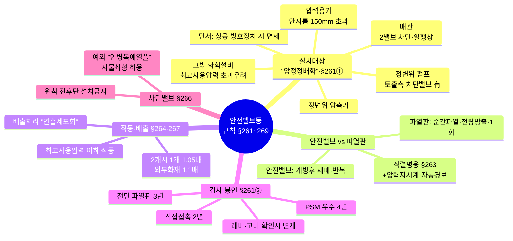
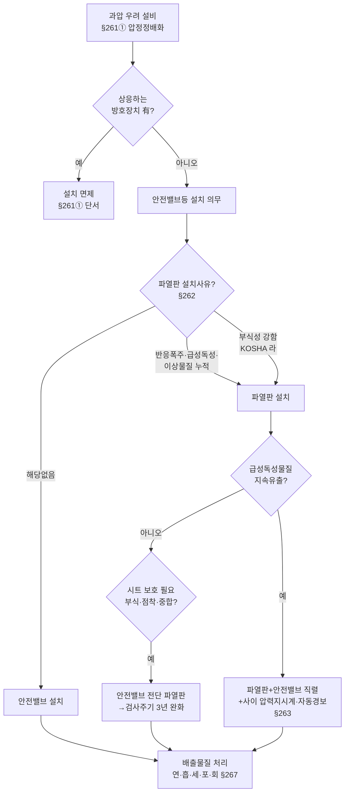
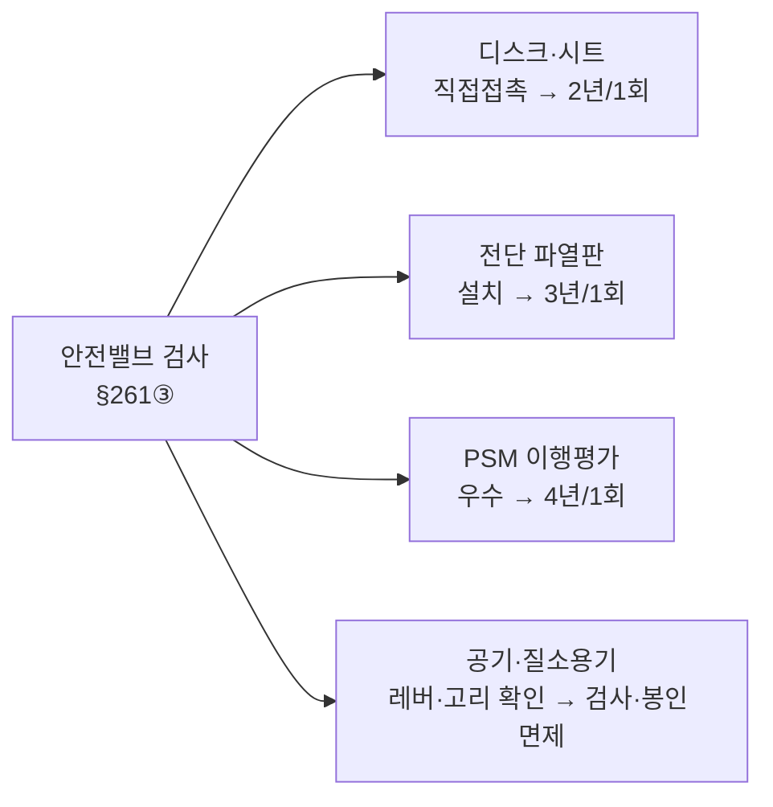
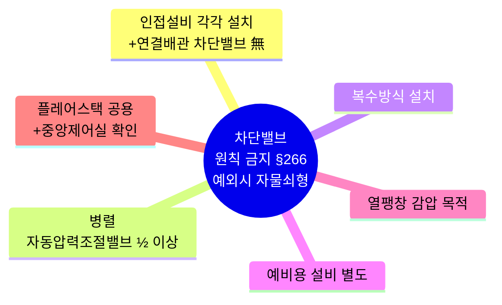

# [도식 샘플] 안전밸브등(안전밸브·파열판) 설치체계

> 흩어진 문항(Q1-1 ~ Q1-38)을 하나의 다이어그램으로 묶은 토픽 시각화 샘플.
> Mermaid로 작성 — GitHub·VS Code(확장)·Obsidian에서 바로 렌더됨.
> 모든 내용은 산업안전보건기준에 관한 규칙·KOSHA·안전인증고시 **원문 기준**.

---

## 1. 전체 조망 (마인드맵) — Q1-1·3·6·14·15·18·23·38

---

## 2. 설치 의사결정 흐름 (안전밸브냐 파열판이냐) — Q1-1·3·13·25

---

## 3. 검사주기 한눈에 — Q1-2·22

> 💡 **암기** 검사주기 **"직2·파3·우4"** — **직**접접촉 2년, **파**열판전단 3년, **우**수사업장 4년

---

## 4. 차단밸브 설치금지 예외 6가지 — Q1-15

> 💡 **암기** **"인병복예열플"** — **인**접·**병**렬·**복**수·**예**비 갖추면 **열**쇠 채워 OK, **플**레어는 중앙제어로
